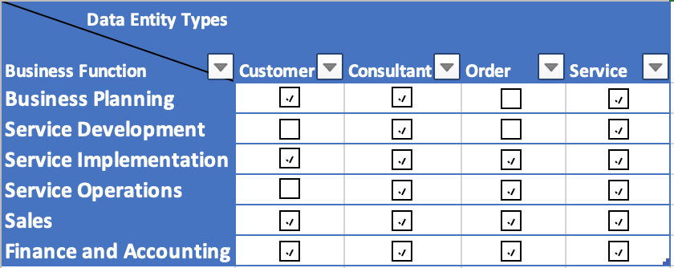
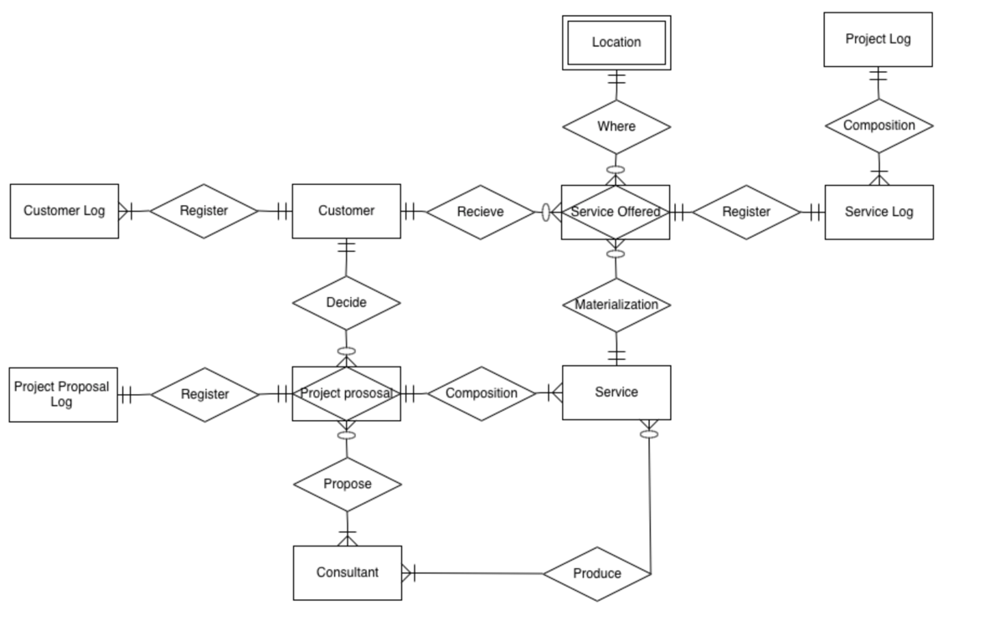
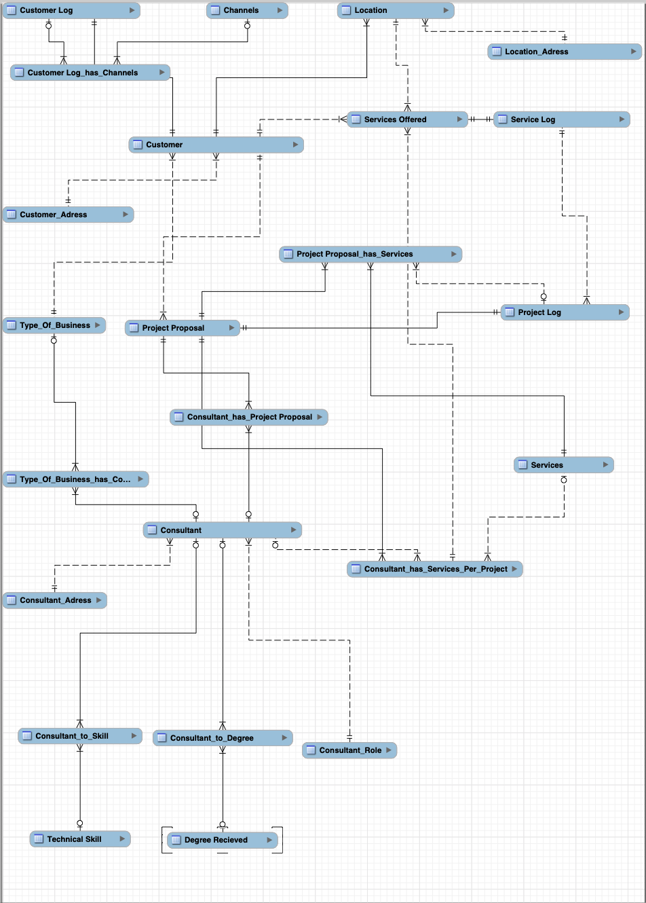
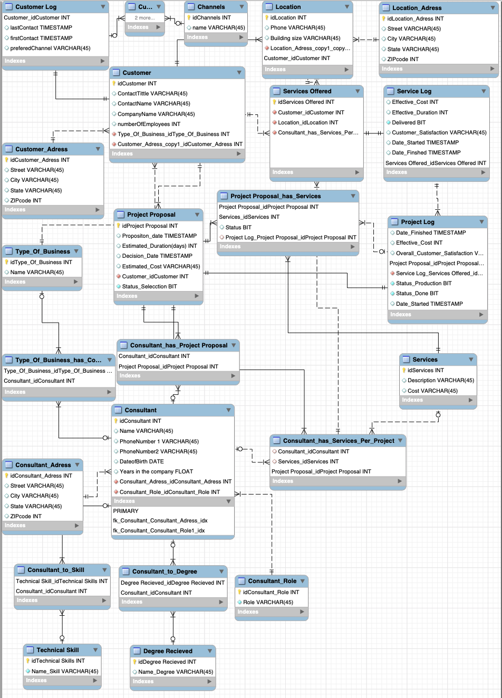
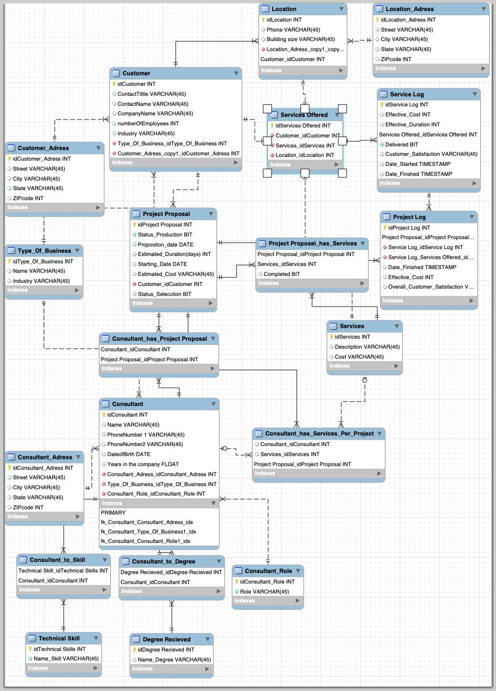
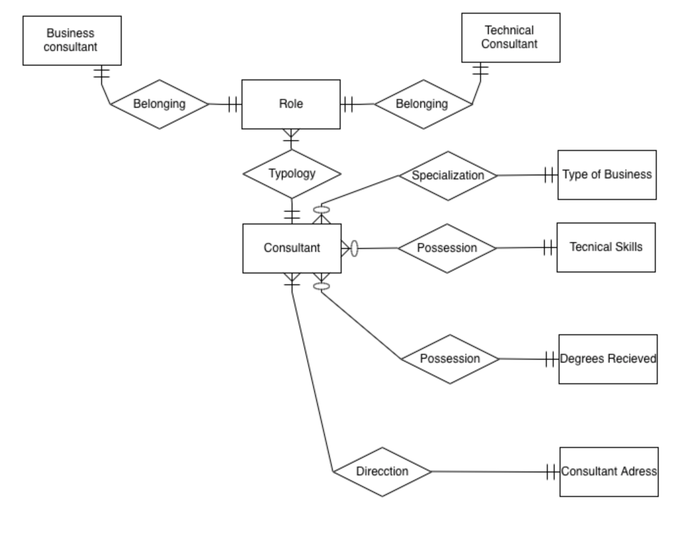

DATA MANAGEMENT- ASSIGMENT II
>
> José Faustino Martínez-Delgado Rubio
>
**STEP 1 : Formulating the business case**
>
> I will write the main goals here as we are going to constantly refer to them:
- Understanding the clients in great depth (past, existing and prospective customers, i.e. clients who have interacted with Hyper- AI-Analytics through any channels
- Understanding consultants performance in more depth (what projects they have performed well, in which industries
- Automate the tracking of clients and also projects, whenever possible.

**Task 1.1 & 1.2** 
What are the problems with the current approach (traditional file processing system) and why a database approach and data-warehousing
serves the company's specified goals better?

Dear management team, as you may well know there are several drawbacks
of maintaining a traditional file processing system, mainly due to two main
factors:

- Lack of harmonization: From managing different databases, with different use standards, metadata, procedures, programs, etc. Which ultimately
leads to problems in data sharing among dBs and/or departments, increased development and debugging times (E.g. data duplication)
- Highly costly solution: Apart from all the relatedopportunity cost in efficiency and effectiveness with the lack of harmonization of the data across the company, it is highly expensive the cost of managing and developing different apps and databases.

Therefore, adopting a database-approach or a data-warehousing solution would mostly solve these problems, increasing harmonization of the data
allowing to interpret and manage data more efficiently thought-out the company environment and decreasing the amount of the IT budget once implemented and
the transition is finished. A cost reduction mainly related with the decrease of maintaining costs and the increase of automatization of different administrative
tasks. Therefore, it allows to automate tasks related with the tracking of projects and management and improves our understanding of clients and
consultants'characteristics, as the goals of our project states.

**Task 1.3** 
what data you will most likely need to create a database?

I will need data from different entities which realize different
activities in relation with the business as usual functions of the company, as this simplified
table would represent:
>
> {width="5.833333333333333in"
> height="2.3194444444444446in"}

Therefore, we will need data from the different Customers (contact
details, size of company...), Consultants (As our employees we would need indicators
of their performance, contact details, qualifications...), the projects or orders
to perform different services (estimated cost, services included, for which
customer, consultants who work on the project...) and Services that we offer
(cost, typology...).

**Task 4.1** 
what are the main steps to implement a database solution
(following a generic systems development life cycle approach).

- Firstly, we have to plan our strategy: What do we have? What do we need? Why do we need it, which are our goals? 
We already mention in the preceding points the reasoning behind adopting a database approach and the goals are stated in the task assignment. Also, we need to assess
the nature of the company in order to scope the database requirements in order to align them with the business functions of the company.

- Secondly, we need to analyze in depth the business to see how the business as usual processes are implemented to develop a conceptual database model that would collect and reflect those interactions.

- Afterwards, it is time to make the design feasible by introducing the logical relations needed to express the reality within the database logic and
constraints in order to ensure data reliability and integrity. Apart of designing solutions to avoid security breaches, data duplicity and other
potential problems derived from an inconsistent database design.

- Then, we will need to implement this design by coding the database, the queries procedures and test the general environment in search of different
bugs or inconsistencies. Apart from deliver the different resources, tools and training required for employees to effectively use the database. A
specially important phase of transition that needs the support of the managers and the participation of the staff that are going to update and
maintain the database.

- Finally, do the necessary maintenance of the database, from data recovery, database bug monitoring to implementing the cycle again to adapt to changes in the business environment.

**STEP 2 -- CONCEPTUAL DESIGN**

**Task 2.1** 
Considering the main business goals of the data
management implementation process, try to assess the information that is provided
to you above. Can you think of any other entities, attributes, relationships
that could be relevant for the business goals, and the company should be able to
collect them in the future?

There are several considerations that we should take into account in order to accomplish the goals proposed: 1) understanding clients, 2)
understanding consultants performance (both proposed projects and produced or in production projects) and 3) trying to better track clients and projects.
Therefore, apart from the entities described in the document, we need to:

- 1/ we will need to create more attributes to know the relationships that we have with our customers, such as the industry they operate, or the
project that we had already made with them, last contact, number of contacts, channels used to contact them... We will also need to know the feedback
that we have from them.

- 2/ We need to tackle 2 types or efficiency of the consultants, on one hand regarding the business consultants, we need to know how many project
proposals had been accepted; and on the other hand, in relation to the technical consultants we need to know their performance on time and quality when providing their services.

- 3/ Create logs in order to tackle the state of the projects and how many services we still have to provide to finalize the project. One
service, one service log; one project, one project log.

**Task 2.2: /** 
Create and ER-diagram based on the provided specifications and
your suggestions in your first task in this design step. Document the
design choices that you make, most importantly what you choose as the
identifiers for different entities and how these identifiers are included as attributes
of other entities to establish relationships. Furthermore, if for some
relationship includedin your design, the above specifications do not provide sufficient
information on type and cardinality, make your choice and describe your reasoning (i.e.
why you specify a relationship as one- to-one, one-to-many, many-to-many,
optional or mandatory).
> So this is our first draft:

> {width="5.429166666666666in"
> height="3.4284689413823273in"}

We had made several assumptions based on the information given and we are going to explain them based on the relation of the introduced entities:

> One to one relations: 

- We had added different entities such as logs for leaving a print on how customer accept projects (Project Proposal Log), how we communicate with our customers (consumer Log), and what is the current situation and historical data of different produced or ongoing projects and services (Service Log and Project Log). As all of them are one to one relation, it is acceptable that log would share the Primary key of their entity as Foreign Primary Key.
Logs would save historical data which is useful for business intelligence purposes. 

> One to many relations:

- Customers could be offered none, one or more projects to be accepted. (Customer – Project Proposal)
- Services offered could only have one typology of service. (Service Offered – Services )
- A project consist of one or more services. (Project Proposal – Services // Project Log – Services Log)
- Customers could receive none, one or more services (Customer – Services Offered)
- Services could be offered in none (online), one or more Locations (Service Offer – Location)
- Even if it is not in the preliminary draft, we have to consider that customers could have different locations as the assumptions of the task lead us know. Therefore, there is another one to many relation that would be a foreign key in the customer entity.
- Finally, Service Offer, as an associative entity with many to one relations would have its own primary key with foreign keys from their associated entities.
  
> Many to many relations:

 - We have two many to many relationships: “Consultants – Service” As the services they provide. As well as, “Consultants – Project Proposal” as the projects they propose to customers. As we are assuming that not only an individual consultant but a team of them could make proposals or carry on service activities.

There is still several topics that would be fixed in the following tasks. However, writing this specific text after I have developed an ER model, I could see how I mistakenly had connected Consultants and services (the typology of them), instead of connecting them to the developed or assigned tasks per project. This example of a mistake could probably had been avoided if I had planned which are the foreign keys that services and projects proposal (and for a while Accepted Project/Order) would have had.

**STEP 3 -- LOGICAL DESIGN**

**Task 3.1/** 
write a short summary (max 1 page) on the differences between relational and non-relational databases, in what situations you would
use non-relational solutions (in particular about big data), and whether you think in the line of business the company is (and the current business goals of
database development, there will be need to transition to NO- SQL solutions in the near future.

There are several main differences from the structure of the database till the typology and format of data collected. In a nutshell, in the relational approach the entities, relationships and attributes correspond to a determined structure consisting of data tables that interact with each other following a business logic, while in “non-relational” databases this structure answer to other variables at the time of consulting/querying. Therefore, it is useful to discover relations between different variables.

If we need to assess whether to adopt a relational or non-relational approach according to the objective goals, we have to realize that they are putting their focus on trying to understand better the customers and the performance of the consultants. Therefore, I could be argued that if they want to analyze the correspondence between consultants and customers to assess their adequacy and effectiveness using the language to develop successful project proposals a NO- SQL solution would become handy, as we don’t know the relation of the different variables nor all the variables. Also, if they would like to expand their business by scouting the market to find new customers to approach, NO-SQL would be useful to gather lots of different information that may become handy.

However, from a management point of view, their internal databases could still use the relational model as you need to ensure data integrity. We don’t need to guess or estimate the relationship between a consultant and their paycheck, we already know it, and we need data integrity in order to accurately deliver the right amount to our employee.
In conclusion, a relational model seems the most appropriate to deal with managerial tasks as it maintains data reliability, however NO-SQL solutions could be used for certain purposes. I do not see the inconvenience to use both for different purposes.

**Task 3.2 & 3.3/** 
Map the ER diagram you developed in the previous step to a relational schema. Be sure to appropriately identify the primary and
foreign keys as well as clearly state referential integrity constraints. Assess what
normal form your model is in, and if needed, perform the steps to transform it into
second normal form at least.

I had made several ER model till I have been satisfied, in order to do so I had carried some normalization of the database:

- Remove multivalued attributes: I had removed several of them to stablish many to many relationships, and whose relation normally is optional (as we could have consultants without skills nor degrees, for example). These multivalued attributes are: Channels (where we contact our customers), all of the addresses (Location_Adress, Customer_Adress, Consultant_Adress), the skills, degrees and the role of our consultants. Also, type of business is both shared by consultants in a many to many relationship, while for customers it could be only be considered as one typeof business. I would like to include the entity “Industry” to be connected in a many to many relation with the Customers and Consultants. However, I do not have more space to do so without losing readability of the ER model.

- Remove partial dependencies: I could not spot any partial dependency in the final model.

And this is the final ER model I developed where we can see the relation among the different entities:
>
> {width="5.1722222222222225in"
> height="7.225898950131233in"}

In this one we could also observe the primary keys and foreign keys:

{width="6.6375in"
height="9.23114501312336in"}

**Step 4: Physical database design and performance**

**Task 4.1 /** 
Write a 1 page summary, where you discuss the benefits of denormalization, and try to identify 2-3 examples in the logical model you created above, where you would want to introduce denormalization, and why this denormalization would help in monitoring and analyzing data related to business goals (Hint: try to think about queries (no need to formulate them, just consider what they would do) that you would frequently run after the database is in place to address business goals, e.g. profitability analysis of consultant based on some attributes, analysis of revenue from different service types etc.; after you identify these important queries, think about what joins would be performed frequently, and how denormalization would create new tables that would make joins unnecessary)

These transformations are useful for improve the speed of access to data queries, as we could avoid to do joins that normally decrease the performance of accessing the stored data. Therefore, we should try to do this denormalization when we need to create tables that are going to be accesses frequently. However, this process could increase anomalies in the database as data duplicity.

In the above ER model we can already observe few denormalization transformations. As we had already take into account the main goals of our project, to have information of our customers and consultants as well as tracking the state of our projects:

- Tracking of the project delivered services is possible because we included in the entity “Project Proposal_has_Services” and Id of the Project Log. Therefore, we can by simply selecting this entity and filtering by “idProject Proposal” see how many services of the project have been made already.
- We could also see which are the assigned services per project and per consultant by selecting “Consultant_has_Services_per_Project”
- Also maybe we could consider to integrate other features according to these business goals, such as:
  - Filtering feedback per service of a consultant.
  - Filtering accepted project proposals by consultant or customers
  - Filtering expected time delivery (we need to add this attribute in “Project Proposal_has_Services”) of services by “effective_duration”. Or doing the same but comparing expected and effective cost of services or project.

**Task 4.2 /** 
You need to perform some basic usage analysis with the following parameters: the company has approx. 200 consultants (120 business, 140 technical, there is an overlap as there are consultants who deal with both business and technical issues), there are 400 customer companies with each approx. 3-4 locations. In the company, consultants run queries on analyzing the status of different provided service types on each of the locations on an hourly basis. How many queries would this mean on a daily basis? Does this problem give you further ideas for denormalization?

Trying to assess the number of queries of this type we could to take into consideration or assume that those enterprises have ongoing services in all their
locations (400*3.5 =1400), that all of our consultants do these queries on an hourly basis (that is 7 queries per consultant in hour. 1400/200) and that they work 8 hours on day. Therefore, the daily queries executed would be 11200. (number of queries per hour: 1400 * working hours per day: 8).

In this case it would be advisable to try to create a table in the database that avoid the use of joining clauses. This table would also need to be as automatized as possible, to avoid inserting mistakes, the same situation as the entity “Project Proposal has Services” that I had designed. I would have to add the location as another candidate key per service offered somehow in the table for every and record it every time we insert a service offer, or even better I could make another table where all the services are listed without attending to the project, but to the customer id and the location id (as the hash key of customer Id and Location Id is unique), and then update the status of those services every time we make an insert of a new service offer.

**Step 5 / Data Warehousing and data integration**

**Task 5.1 /** 
describe in max. 1 page, what are the benefits of EDW over Independent Data Marts. As a note, also consider in your description whether in this line of business and for the specified goals you need real-time data warehousing or not.
We could argue that a system of dependent data mars conforming a EDW (Enterprise Data Warehouse) is more beneficial than a system of independent data mars in the same way as a Relational database approach is more beneficial than a NO-SQL solution for this company, as the dependent data mars ensure in a higher degree data integrity and consistency than an independent solution.
Regarding if the company would need real-time data warehousing or not it depends on the nature of the activities of the company and their intentions. However, as they asked to understand customers, consultant performance and tracking of projects and services on real-time. Therefore, it would be a solution to take into consideration, moreover if they are planning to expand their activities or taking into consideration that they already have the know-how of these kind of solutions that improve the quality of business intelligence (Let’s not forget they “provides consulting services focusing on business analytics and business intelligence projects”).

**Task 5.2 /**
As you know from your studies, one main reason for poor data quality is manual entry of information. The management asks you as the final step to assess which of the attributes in your model will most likely require manual entry, i.e. there is no way to automate the collection or even create a simple drop-down with a limited amount of choices (hint: look for attributes that require detailed description)

For setting up the database we would need to insert list for Type of business, Industry, Skills, Degrees, Channels, Industry, Role of consultants and service typology (Service table). For all of them we could create dropdowns to choose from. We would also need to record our list of customer and consultants for setting up the environment.

From a business as usual perspective, therefore, regarding the activities the company frequently does:

- We will need to insert details of project proposals (we avoid inserting date with timestamp) and service offer.
- Every time we contract a new consultant, find a new customer or create a new typology of service we will have to do an insertion.
- Finally we would need to assign the different services to the consultants manually per project.
- 
Depending the software we use (like Java) we could create abstract classes to force the insertion of a predefined set of attributes, avoiding data inconsistency. Other attributes such as status or time related could be programmed to be updated as we insert service offer or proposal decisions.

**ANNEX I**
> Former uncomplete ER model, before setting the possibility of having
> null values in some relations, with some mistakes in the attributes
> such as Industry being part of the entity Customer and
> Type_Of_Business, without few entities such as Customer Log and their
> channels plus the difficulty to assess the number of services that we
> still need to carry on in order to finish the project (no FK of
> Project Log in Project\
> Proposal_has_services).

{width="5.6in"
height="7.783051181102362in"}

**ANNEX II**

> First try of trying to normalize conceptually how to get rid of multivalued attributes.

{width="5.901388888888889in"
height="4.614869860017498in"}
